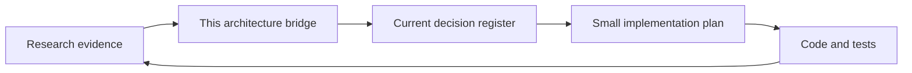

# Quant Research OS

This folder is a small bridge from research evidence to safe implementation. It
does not replace the current decision register or the research manual.

## Read This First

1. `.agents/current_decisions.md` is the authority for what is allowed now.
2. `docs/research_manual/` records research evidence and historical context.
3. This folder explains how an approved idea fits the existing repository.

## The Only Flow

Research never changes live configuration directly. The required promotion path
is research, cost-adjusted backtest, gate, bounded paper observation, then
explicit live review.

## Documents

- [Architecture and contracts](architecture.md): boundaries, external-project
  lessons, and shared names.
- [Implementation gate](implementation_gate.md): the smallest safe path from
  an idea to a repository change.
