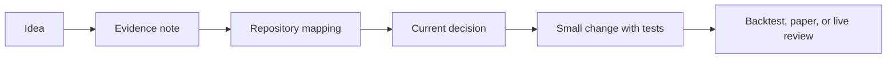

# Research To Implementation Gate

## Required Sequence

Before changing code, record only what is necessary:

| Step | Record | Location |
|---|---|---|
| Evidence | claim, data, costs, baseline, limitations | `docs/research_manual/` |
| Mapping | module, contract, safety boundary, test | this folder or implementation plan |
| Authority | allowed scope and promotion status | `.agents/current_decisions.md` |

## Default Blockers

Do not promote an idea when costs, out-of-sample evidence, baseline comparison,
live-like execution semantics, or protection behavior are unclear. Research
reports are evidence only and cannot change runtime configuration.

## Minimal Migration Order

1. Add a read-only research artifact or report.
2. Introduce a shared contract only where duplication proves it is needed.
3. Adopt it in backtest before paper or live.
4. Use the existing promotion gates for paper and live review.

For current strategy direction and promotion rules, defer to
`.agents/current_decisions.md`; it overrides this document if they conflict.
